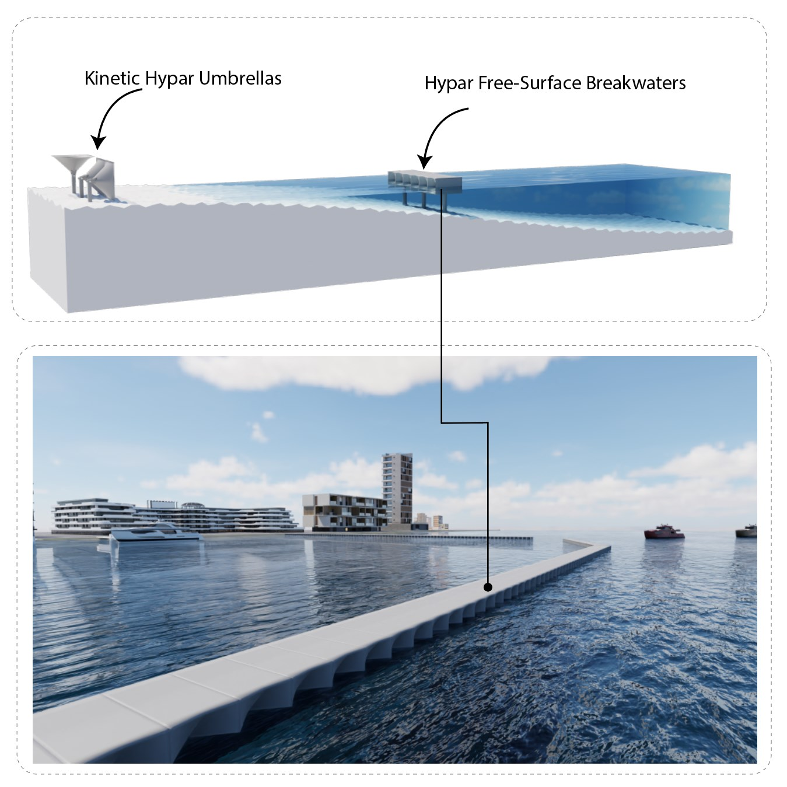

# Hypar Free-Surface Breakwater (FSBW)

This repository contains the data, files, and scripts associated with the research paper:  
**Hyperbolic Paraboloid Free-Surface Breakwaters: Hydrodynamic Study and Structural Evaluation**  
**Authors:** Hamid ElDarwich, Gaoyuan Wu, Krisna A. Pawitan, and Maria Garlock  
**Institution:** Department of Civil and Environmental Engineering, Princeton University, Princeton, NJ, USA  

---

## Abstract
This study investigates the potential of hyperbolic paraboloid (hypar) shapes for enhancing wave attenuation and structural efficiency in Free-Surface Breakwaters (FSBW). A decoupled approach combining **Smoothed Particle Hydrodynamics (SPH)** and the **Finite Element Method (FEM)** is employed to analyze the performance of hypar-faced FSBWs across varying hypar warping values and wave characteristics. SPH simulations, validated through experiments, assess wave attenuation performance and extract pressure values for subsequent FEM analysis. Results indicate that hypar-faced FSBWs achieve increased wave attenuation compared to traditional flat-faced designs, particularly for shorter wave periods and smaller drafts. Furthermore, hypar surfaces exhibit up to three times lower principal stresses under wave loading compared to their flat counterparts, enabling the possibility of thinner and more efficient designs. The study also reveals that peak-load static stress values provide a reliable approximation for preliminary design, showing less than 6% average difference when compared to dynamic analysis results. This research positions hypar-faced FSBWs as a promising alternative in coastal defense strategies, addressing challenges posed by rising sea levels and increasing storm intensities.

---

## Repository Structure
The repository is organized into the following:

- **Main**: 
  - **SPH**: Includes XML configuration files and other files required to run SPH simulations.
  - **Experiment**: Contains experimental data generated from the wave flume.
  - **Structural Analysis**: Includes finite element analysis (FEA) data.
  - **Utilities**: Contains useful Python scripts for pre-processing and post-processing of results.

---